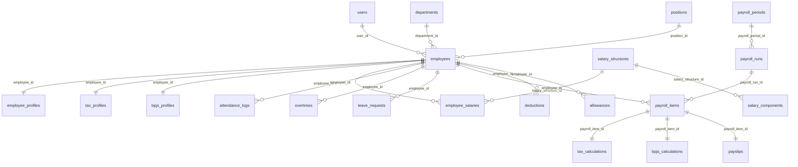

# Indonesian Payroll System — Design Document

> Compliance reference target: **Indonesian Labor Law (UU 13/2003 + UU 6/2023 Cipta Kerja)**, **PP 36/2021** (wages), **PP 35/2021** (overtime, severance), **PP 58/2023** + **PMK 168/2023** (PPh 21 TER), **UU HPP 7/2021** (income tax brackets), **PP 84/2013 / PP 82/2019** (BPJS Ketenagakerjaan), **Perpres 64/2020** (BPJS Kesehatan), **PMK 101/2016** (PTKP).

This document covers the regulatory foundation, system architecture, schema, payroll engine, and scaling strategy. The repo at the root of this document contains the corresponding scaffolded Laravel 12 implementation.

---

## Phase 1 — Indonesian Payroll Regulation Analysis

### 1.1 Salary Components

Indonesian wage structure under **PP 36/2021** distinguishes:

| Component | Indonesian term | Tax (PPh 21) | BPJS base | Notes |
|---|---|---|---|---|
| Basic salary | Gaji pokok | Yes | Yes | Must be ≥ 75% of `gaji pokok + tunjangan tetap` |
| Fixed allowance | Tunjangan tetap (jabatan, keluarga) | Yes | Yes | Paid regardless of attendance |
| Variable allowance | Tunjangan tidak tetap (transport, makan) | Yes | No (mostly) | Tied to attendance |
| Overtime | Lembur | Yes | No | Per PP 35/2021 |
| THR | Tunjangan Hari Raya | Yes | No | 1× monthly salary, religious holiday |
| Bonus | Bonus / insentif | Yes | No | Performance-based |
| Severance | Pesangon | Yes (final) | No | Separate flat tax (PP 68/2009) |
| Reimbursement | Penggantian | No | No | Actual cost reimbursement |
| BPJS employer contributions | — | Most are taxable benefits-in-kind | — | Kesehatan, JKK, JKM employer share is taxable to employee (gross-up vs. net method) |

**Minimum wage (UMP/UMK)**: Set annually per province/regency by governor decree. The system stores `umk_value` per `province_id`/`city_id` and a guard in `EmployeeSalaryService` rejects basic salaries below the applicable UMK unless an exemption flag is set.

### 1.2 BPJS Contribution Rules

Two umbrella programs:

#### A. BPJS Ketenagakerjaan (employment)

| Program | Employer | Employee | Salary cap (2024) | Reference |
|---|---|---|---|---|
| **JHT** (Jaminan Hari Tua / old age) | 3.70% | 2.00% | None | PP 46/2015 |
| **JP** (Jaminan Pensiun / pension) | 2.00% | 1.00% | Rp 10,547,400 | PP 45/2015, last upd. 2024 |
| **JKK** (Jaminan Kecelakaan Kerja / work accident) | 0.24%–1.74% | — | Total wage | PP 44/2015. Risk grade I=0.24%, II=0.54%, III=0.89%, IV=1.27%, V=1.74% |
| **JKM** (Jaminan Kematian / death) | 0.30% | — | Total wage | PP 44/2015 |

#### B. BPJS Kesehatan (health)

| Component | Employer | Employee | Cap (2024) |
|---|---|---|---|
| BPJS Kesehatan | 4.00% | 1.00% | Rp 12,000,000 |

> Base wage for BPJS = **gaji pokok + tunjangan tetap**.

**Formula example** (employee with `base = Rp 8,000,000`, JKK risk grade I):

```
JHT  employee = 8,000,000 × 0.02   = 160,000
JHT  employer = 8,000,000 × 0.037  = 296,000
JP   employee = 8,000,000 × 0.01   = 80,000     (8M < 10.547M cap)
JP   employer = 8,000,000 × 0.02   = 160,000
JKK  employer = 8,000,000 × 0.0024 = 19,200
JKM  employer = 8,000,000 × 0.003  = 24,000
Kes  employee = 8,000,000 × 0.01   = 80,000
Kes  employer = 8,000,000 × 0.04   = 320,000
```

The **employer's BPJS Kesehatan + JKK + JKM contributions are taxable income** for the employee under PMK 252/2008 (treated as a *natura* benefit since UU HPP 2021).

### 1.3 PPh 21 — Tax Calculation

Two regimes coexist after **PP 58/2023 + PMK 168/2023** (effective 2024):

#### A. Monthly withholding (Jan–Nov) — **TER (Tarif Efektif Rata-rata)**

A flat-rate table based on **gross monthly income** and **PTKP category** (TER A / B / C).

| PTKP category | PTKP value | TER table |
|---|---|---|
| TER A | TK/0, TK/1, K/0 (54M, 58.5M, 58.5M) | TER-A |
| TER B | TK/2, TK/3, K/1, K/2 (63M, 67.5M, 63M, 67.5M) | TER-B |
| TER C | K/3 (72M) | TER-C |

PTKP per **PMK 101/2016**:

| Status | PTKP (annual) |
|---|---|
| TK/0 | 54,000,000 |
| TK/1 | 58,500,000 |
| TK/2 | 63,000,000 |
| TK/3 | 67,500,000 |
| K/0  | 58,500,000 |
| K/1  | 63,000,000 |
| K/2  | 67,500,000 |
| K/3  | 72,000,000 |

**Monthly PPh 21 (Jan–Nov) = `gross_monthly × TER%`**. The TER tables are stored in `config/payroll/ter.php` and seeded into the `tax_ter_brackets` table (full table per PMK 168/2023 Annex I; ranges from 0% up to 34%).

#### B. Annual reconciliation (December) — **Article 17 progressive rates** (UU HPP)

| Annual taxable income (PKP) | Rate |
|---|---|
| up to 60,000,000 | 5% |
| 60,000,001 – 250,000,000 | 15% |
| 250,000,001 – 500,000,000 | 25% |
| 500,000,001 – 5,000,000,000 | 30% |
| above 5,000,000,000 | 35% |

**December calculation**:

```
1. Annual gross           = Σ gross of Jan–Nov + Dec gross
2. Biaya jabatan          = min(5% × annual gross, 6,000,000)
3. JHT/JP employee yearly = Σ employee JHT + JP
4. Net annual             = annual gross − biaya jabatan − (JHT+JP)
5. PKP                    = net annual − PTKP    (rounded down to nearest 1,000)
6. PPh 21 annual          = progressive(PKP)
7. PPh 21 December        = PPh 21 annual − Σ PPh 21 Jan–Nov
```

Employees without NPWP are subject to a **20% surcharge** on PPh 21.

#### Worked example (TER A, gross 10M/month, full year)

```
Monthly TER (2%) × 10,000,000 = 200,000   (Jan–Nov: 11 × 200,000 = 2,200,000)

Year-end:
gross annual    = 120,000,000
biaya jabatan   = 6,000,000        (capped)
JHT+JP employee = 120M × 3% = 3,600,000
net annual      = 110,400,000
PTKP (TK/0)     = 54,000,000
PKP             = 56,400,000
PPh21 annual    = 5% × 56,400,000 = 2,820,000
PPh21 December  = 2,820,000 − 2,200,000 = 620,000
```

### 1.4 Overtime Rules (PP 35/2021 Pasal 31)

Hourly rate divisor = **1/173 × monthly wage** (`gaji pokok + tunjangan tetap`).

#### Workdays (5 or 6-day workweek)

| Hour | Multiplier |
|---|---|
| 1st hour | 1.5× |
| 2nd hour onwards | 2× |

#### Rest day / public holiday — 6-day workweek

| Hour | Multiplier |
|---|---|
| 1–7 | 2× |
| 8 | 3× |
| 9–10 | 4× |

#### Rest day / public holiday — 5-day workweek

| Hour | Multiplier |
|---|---|
| 1–8 | 2× |
| 9 | 3× |
| 10–11 | 4× |

**Cap**: max 4 hours/day and 18 hours/week on workdays.

**Worked example**: monthly wage = Rp 5,000,000, 3 hours overtime on a workday:
```
hourly = 5,000,000 / 173 = 28,902
overtime = (1.5 × 28,902) + (2 × 2 × 28,902)
        = 43,353 + 115,608
        = 158,961
```

### 1.5 THR (Tunjangan Hari Raya)

Per **PP 36/2021** + **Permenaker 6/2016**:

- Paid **at least 7 days before** the religious holiday (Idul Fitri, Natal, Nyepi, Waisak, Imlek, depending on the employee's religion).
- **Tenure ≥ 12 months** → 1× monthly wage (`gaji pokok + tunjangan tetap`).
- **Tenure 1–<12 months** → `(months_worked / 12) × monthly_wage`.
- Tenure < 1 month → no THR obligation.
- Subject to PPh 21 (treated as irregular income — added to annual gross in December reconciliation).

### 1.6 Reporting Obligations

| Report | Frequency | Recipient |
|---|---|---|
| **SPT Masa PPh 21** (form 1721) | Monthly | DJP (Direktorat Jenderal Pajak) — via e-Bupot 21/26 since 2024 |
| **Bukti Potong 1721-A1** | Annual (per employee) | Employee + DJP |
| **iuran BPJS Ketenagakerjaan** report | Monthly | BPJS Ketenagakerjaan portal (SIPP) |
| **iuran BPJS Kesehatan** report | Monthly | BPJS Kesehatan e-Dabu |
| **WLKP** (Wajib Lapor Ketenagakerjaan Perusahaan) | Annual | Kemnaker |
| **Salary accounting journal** | Monthly | Internal finance |

The system generates Excel + PDF for all of the above; an exporter producing **DJP-compliant XML for e-Bupot 21** is stubbed (`App\Services\Reporting\EBupotExporter`) and intended for follow-up implementation against DJP's current XSD.

---

## Phase 2 — System Architecture

### 2.1 High-level architecture

```
                   ┌─────────────────────────────┐
                   │      Filament v4 Admin      │
                   │   (HR / Finance / Admin)    │
                   └──────────┬──────────────────┘
                              │
        ┌─────────────────────┴─────────────────────┐
        │            Laravel 12 App                 │
        │  ┌─────────────┐    ┌──────────────────┐  │
        │  │ HTTP Layer  │    │  Sanctum API     │  │
        │  │ (Filament   │    │  /api/v1/*       │  │
        │  │  + Web)     │    │                  │  │
        │  └─────┬───────┘    └────────┬─────────┘  │
        │        │                     │            │
        │        ▼                     ▼            │
        │  ┌─────────────────────────────────────┐  │
        │  │       Service Layer (Domain)        │  │
        │  │  ┌─────────────┐  ┌──────────────┐  │  │
        │  │  │  Payroll    │  │   Reporting  │  │  │
        │  │  │  Engine     │  │    Service   │  │  │
        │  │  └─────────────┘  └──────────────┘  │  │
        │  │  ┌─────────────┐  ┌──────────────┐  │  │
        │  │  │  BPJS Calc  │  │  Tax (TER)   │  │  │
        │  │  └─────────────┘  └──────────────┘  │  │
        │  └────────────┬────────────────────────┘  │
        │               ▼                           │
        │  ┌─────────────────────────────────────┐  │
        │  │      Repository Layer (Eloquent)    │  │
        │  └────────────┬────────────────────────┘  │
        └───────────────┼───────────────────────────┘
                        ▼
       ┌────────────┐  ┌─────────┐  ┌──────────────┐
       │  MySQL 8   │  │  Redis  │  │  S3 (filesystem)│
       │ (OLTP)     │  │ (cache, │  │  (payslip PDFs) │
       │            │  │  queue, │  │                 │
       │            │  │ Horizon)│  │                 │
       └────────────┘  └─────────┘  └──────────────┘

        ┌──────────────────────────┐
        │  Laravel Horizon workers │  ← runs payroll calc jobs
        └──────────────────────────┘

        ┌──────────────────────────┐
        │  Scheduler (cron)        │  ← monthly close, THR triggers
        └──────────────────────────┘
```

### 2.2 Service layer

Domain services live in `app/Services/Payroll/`:

```
PayrollEngine          — orchestrates a payroll run
├── AttendanceImporter — CSV/Excel → AttendanceLog
├── OvertimeCalculator — applies PP 35/2021 multipliers
├── BpjsCalculator     — JHT, JP, JKK, JKM, Kesehatan
├── Pph21TerCalculator — monthly TER per PMK 168/2023
├── Pph21AnnualCalculator — December reconciliation (UU HPP)
├── PayslipGenerator   — DomPDF rendering
└── PayrollWorkflow    — state machine (draft → calculated → approved → paid)
```

Each service:
- Accepts and returns immutable **DTO objects** (`app/DTO/`).
- Has zero direct knowledge of Eloquent (testable in isolation).
- Is injected via Laravel's container.

### 2.3 Module architecture

```
app/
├── Domain/              # pure-PHP value objects (Money, TaxStatus, etc.)
├── DTO/                 # data transfer objects between layers
├── Models/              # Eloquent models (persistence layer)
├── Repositories/        # data access — wraps Eloquent queries
├── Services/
│   ├── Payroll/         # payroll engine
│   ├── Reporting/       # PDF/Excel exporters
│   └── Tax/             # PPh21 tables + lookups
├── Filament/            # admin panel resources
├── Http/
│   ├── Controllers/     # API + Web controllers
│   └── Resources/       # API JsonResource wrappers
└── Providers/
```

### 2.4 API architecture (Sanctum)

```
POST   /api/v1/auth/login                  → token
GET    /api/v1/me                          → authenticated user
GET    /api/v1/employees                   → list (admin/HR)
POST   /api/v1/employees                   → create
GET    /api/v1/employees/{id}              → show
PUT    /api/v1/employees/{id}              → update
GET    /api/v1/payroll-periods             → list
POST   /api/v1/payroll-runs                → create + queue
POST   /api/v1/payroll-runs/{id}/calculate → enqueue calc job
POST   /api/v1/payroll-runs/{id}/approve   → approve (finance)
GET    /api/v1/payslips/{id}               → JSON
GET    /api/v1/payslips/{id}/pdf           → application/pdf
```

All API routes are rate-limited (`throttle:api` = 60/min default; tighter on auth endpoints).

### 2.5 RBAC

Powered by `spatie/laravel-permission`. Roles are seeded:

| Role | Permissions |
|---|---|
| `super_admin` | wildcard `*` |
| `hr` | manage employees, departments, positions, salary structures, attendance, leave, overtime; view payslips |
| `finance` | view employees & salaries; manage payroll periods, runs, approval; manage tax/BPJS configs; export reports |
| `employee` | view own profile, own payslips, submit leave/overtime requests |

Filament `canViewAny()` / policies map permissions per resource.

---

## Phase 3 — Database Design

### 3.1 ERD (Mermaid)



### 3.2 Table summary

| Table | Purpose |
|---|---|
| `users` | login accounts |
| `employees` | personnel master |
| `employee_profiles` | KTP, NPWP, address, bank, contact |
| `departments`, `positions` | org structure |
| `salary_structures` | named templates (e.g. "Engineer L3") |
| `salary_components` | line items in a structure (basic, allowances, etc.) |
| `employee_salaries` | effective-dated salary assignment per employee |
| `attendance_logs` | daily check-in/out |
| `overtimes` | approved overtime hours |
| `leave_requests` | leave master with approval workflow |
| `payroll_periods` | monthly periods (`2024-01`, `2024-02`, …) |
| `payroll_runs` | one execution of a period (draft → calculated → approved → paid) |
| `payroll_items` | per-employee per-run line |
| `tax_profiles` | NPWP, PTKP status, TER category |
| `tax_calculations` | per-item PPh 21 detail |
| `bpjs_profiles` | BPJS membership numbers, JKK risk grade |
| `bpjs_calculations` | per-item BPJS detail |
| `deductions`, `allowances` | one-off line adjustments |
| `payslips` | finalized PDF + json snapshot |
| `tax_ter_brackets` | seeded TER table (PMK 168/2023) |
| `tax_progressive_brackets` | seeded Art. 17 brackets |
| `bpjs_settings` | rates + caps per fiscal year |
| `umk_values` | minimum wage per province/year |
| `activity_log` | spatie audit trail |
| `permissions`, `roles` | spatie RBAC |

Migrations are in `database/migrations/`. See `App\Models\*` for relationship definitions.

---

## Phase 13 — Scalability

| Headcount | Strategy |
|---|---|
| **1 000** | Single MySQL 8 (db.t3.medium, 30 GB), 1 web + 1 worker container, payroll run completes in < 30 s as a single Horizon job batched per 100 employees. |
| **10 000** | Read replica for reporting, Redis cluster (3-node), 3 web + 3 Horizon workers, payroll run dispatched as a `Bus::batch()` of 1-employee jobs. Average calc: ~5 min. Add MySQL InnoDB partitioning on `payroll_items` by `year(period_start)`. |
| **100 000** | Sharded by `tenant_id` (multi-company SaaS pattern) or by `payroll_period_id`. Move heavy reporting to a columnar store (ClickHouse / BigQuery) ETL'd nightly. Workers autoscale on SQS queue depth. Payslip PDFs rendered async, stored on S3, indexed by CloudFront. Calc completes in ~30 min when batched at 100 jobs × 1000 employees with 50 concurrent workers. Use deferred journal posting to GL. |

Bottleneck mitigation:
- **Calc fan-out**: every payroll run dispatches `CalculatePayrollItem` jobs per employee → linear horizontal scaling.
- **DB writes**: `payroll_items` written via `INSERT … ON DUPLICATE KEY UPDATE` from job result.
- **Read traffic**: payslip PDFs are content-addressed in S3; the app serves CloudFront URLs (signed) so no app server bandwidth.
- **Idempotency**: each calc job keyed by `(payroll_run_id, employee_id)` with an `idempotency_key`.

---

## Phase 12 — Deployment (summary)

See `docker/`, `docker-compose.yml`, `.github/workflows/ci.yml`, and `deploy/README.md`.

```
              ┌──── Nginx (TLS) ────┐
              │                     │
              ▼                     ▼
        php-fpm (web)          php-fpm (horizon)
              │                     │
              └──────────┬──────────┘
                         ▼
                ┌─────────────────┐
                │  MySQL 8 (RDS)  │
                │  Redis (Elasti) │
                │  S3             │
                └─────────────────┘
```

`php artisan schedule:run` runs every minute via cron (or `supervisord` inside the worker container) and triggers:
- `payroll:close-period` (1st of each month, 03:00 WIB)
- `payroll:thr-check` (yearly, 30 days before declared religious holiday)
- `payroll:export-bpjs` (monthly)

---

## Project layout (this repo)

```
indonesian-payroll/
├── app/
│   ├── DTO/                       # PayrollContextDTO, BpjsResultDTO, TaxResultDTO, ...
│   ├── Models/                    # 22 Eloquent models
│   ├── Repositories/              # PayrollRepository, EmployeeRepository
│   ├── Services/Payroll/          # 8 service classes (engine + calculators)
│   ├── Services/Tax/              # PtkpResolver, TerTable
│   ├── Services/Reporting/        # PayslipGenerator, PayrollSummaryExporter
│   ├── Filament/Resources/        # Employee, Department, SalaryStructure, PayrollPeriod, PayrollRun, Payslip
│   ├── Jobs/                      # CalculatePayrollItemJob
│   ├── Http/Controllers/Api/V1/   # REST API
│   └── Policies/
├── config/payroll/
│   ├── ter.php                    # PMK 168/2023 TER tables
│   ├── progressive.php            # UU HPP brackets
│   ├── bpjs.php                   # rates + caps
│   └── ptkp.php                   # PMK 101/2016
├── database/
│   ├── migrations/                # 25+ migration files
│   └── seeders/                   # roles, TER, BPJS, demo employees
├── docker/                        # nginx, php-fpm, supervisord configs
├── tests/
│   ├── Unit/Payroll/              # BPJS, TER, overtime calculators
│   └── Feature/                   # API + payroll workflow
├── .github/workflows/ci.yml
├── docker-compose.yml
└── docs/
    ├── DESIGN.md                  # this file
    ├── API.md                     # endpoint reference
    └── DEPLOYMENT.md
```
